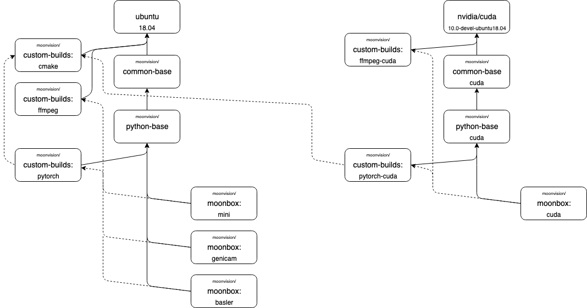

# Moonbox

[](https://github.com/MoonVision/moonbox-docker/actions/workflows/build.yml)

Docker images for computer vision and deep learning.


## Overview

Moonbox are a set of Debian based Docker images made for training and evaluating deep neural networks on video input.



### python-base

Python Base from a [micromamba](https://github.com/mamba-org/mamba#micromamba) environment with basic compute libraries and [runit-docker](https://github.com/kosma/runit-docker).

[Python Base on Docker Hub](https://hub.docker.com/r/moonvision/python-base)

| Build arg | Default | Description |
|-|-|-|
| `baseimage` | `mambaorg/micromamba:1.0.0` | Set baseimage from which python base is built. |

#### Python Base

```
docker build \
  -t moonvision/python-base:latest \
  -f docker/python-base/Dockerfile docker/python-base
```

### Moonbox

[Moonbox on Docker Hub](https://hub.docker.com/r/moonvision/moonbox)

| Build arg | Default | Description |
|-|-|-|
| `baseimage` | `moonvision/python-base` | Set the baseimage from which moonbox is built. |
| `ffmpeg_from_docker` | `moonvision/custom-builds:ffmpeg-4.2.1` | The docker image from which FFmpeg will be installed. |
| `pytorch_from_docker` | `moonvision/custom-builds:pytorch-1.11.0_torchvision-0.12.0` | The docker image from which PyTorch and Torchvision will be installed. |
| `with_genicam` | `false` | Whether to install GeniCam harvesters. |
| `with_pylon` | `false` | Whether to install Basler Pylon. |
| `with_cuda` | `false` / undefined | If `true` install CUDA specific packages. If defined, set ENV variables to mount nvidia binaries at runtime. |

#### Moonbox Mini

Moonbox Mini is the most lightweight Moonbox version. It includes Python, a couple of libraries and FFmpeg.

```
docker build \
  -t moonvision/moonbox:mini-latest \
  -f docker/moonbox/Dockerfile docker/moonbox
```

#### Moonbox with GeniCam

```
docker build \
  -t moonvision/moonbox:genicam-latest \
  --build-arg with_genicam=true \
  -f docker/moonbox/Dockerfile docker/moonbox
```

#### Moonbox with Basler Pylon

```
docker build \
  -t moonvision/moonbox:basler-latest \
  --build-arg with_genicam=true \
  --build-arg with_pylon=true \
  -f docker/moonbox/Dockerfile docker/moonbox
```

#### Moonbox CUDA

```
docker build \
  -t moonvision/moonbox:cuda-latest \
  --build-arg with_cuda=true \
  --build-arg ffmpeg_from_docker=moonvision/custom-builds:ffmpeg-cuda-4.2.1 \
  -f docker/moonbox/Dockerfile docker/moonbox
```

## builders

[Custom Builds on Docker Hub](https://hub.docker.com/r/moonvision/custom-builds)

### FFmpeg

A custom build of [FFmpeg](https://ffmpeg.org).

| Build arg | Default | Description |
|-|-|-|
| `baseimage` | `mambaorg/micromamba:1` | Set the image in which FFmpeg will be built. |
| `ffmpeg_version` | | The FFmpeg release version to build. |
| `with_cuda` | `false` | Whether to build FFmpeg with Nvidia hardware acceleration.  |

#### FFmpeg without CUDA

```
docker build \
  -t moonvision/custom-builds:ffmpeg-latest \
  --build-arg ffmpeg_version=4.2.1 \ 
  -f docker/builders/ffmpeg/Dockerfile docker/builders/ffmpeg
```

#### FFmpeg with CUDA

```
docker build \
  -t moonvision/custom-builds:ffmpeg-cuda-latest \
  --build-arg ffmpeg_version=4.2.1 \ 
  --build-arg with_cuda=true \
  -f docker/builders/ffmpeg/Dockerfile docker/builders/ffmpeg
```

### PyTorch

| Build arg | Default | Description |
|-|-|-|
| `baseimage` | `moonvision/python-base:latest` | Set the image in which PyTorch will be built. |
| `pytorch_tag` | `v1.11.0` | PyTorch version (tag or commit if built, pip version if downloaded). |
| `torchvision_tag` | `v0.12.0` | Torchvision version (tag or commit if built, pip version if downloaded). |
| `prebuilt` | `false` | If `true` [download](https://pytorch.org/get-started/locally/) pip versions instead of building from source. |
| `with_cuda` | `false` | Whether to build/download PyTorch with Nvidia hardware acceleration. |

#### PyTorch without CUDA

```
docker build \
  -t moonvision/custom-builds:pytorch-latest \
  -f docker/builders/pytorch/Dockerfile docker/builders/pytorch
```

#### PyTorch with CUDA

```
docker build \
  -t moonvision/custom-builds:pytorch-cuda-latest \
  --build-arg with_cuda=true \ 
  --build-arg prebuilt=true \
  -f docker/builders/pytorch/Dockerfile docker/builders/pytorch
```
