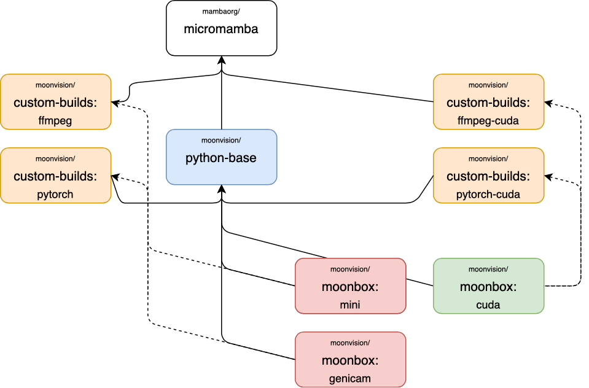

# Moonbox

Docker images for computer vision and deep learning.


## Overview

Moonboxes is a set of Ubuntu based Docker images made for training and evaluating deep neural networks.

**Todo**: update dependencies.jpg


### common-base

[Python Base on Docker Hub](https://hub.docker.com/r/moonvision/common-base)

#### Common Base

```
docker build -t moonvision/common-base:latest -f docker/common-base/image/Dockerfile  docker/common-base/image
```

| Build arg | Default | Description |
|-|-|-|
| `baseimage` | [`ubuntu:20.04`](https://hub.docker.com/u/ubuntu) | Build images based on different Ubuntu versions. |

#### Common Base with CUDA

```
docker build -t moonvision/common-base:cuda-latest -f docker/common-base/image/Dockerfile --build-arg baseimage=nvidia/cuda:11.0-base-ubuntu20.04 docker/common-base/image
```

| Build arg | Default | Description |
|-|-|-|
| `baseimage` | [`nvidia/cuda:11.0-base-ubuntu20.04`](https://hub.docker.com/r/nvidia/cuda) | Build images with different Cuda versions. |

### python-base

[Python Base on Docker Hub](https://hub.docker.com/r/moonvision/python-base)

#### Python Base

```
docker build -t moonvision/python-base:latest -f docker/python-base/Dockerfile docker/python-base
```

| Build arg | Default | Description |
|-|-|-|
| `baseimage` | `moonvision/common-base` | Used to switch between building image with and without CUDA. |

#### Python Base with CUDA

```
docker build -t moonvision/python-base:latest -f docker/python-base/Dockerfile docker/python-base
```

| Build arg | Default | Description |
|-|-|-|
| `baseimage` | `moonvision/common-base:cuda-latest` | Used to switch between building image with and without CUDA. |

### Moonbox

[Moonbox on Docker Hub](https://hub.docker.com/r/moonvision/moonbox)

#### Moonbox Mini

Moonbox Mini is the most lightweight Moonbox version. It includes Python, a couple of libraries and FFmpeg.

```
docker build -t moonvision/moonbox:mini-latest -f docker/moonbox/Dockerfile docker/moonbox
```

| Build arg | Default | Description |
|-|-|-|
| `baseimage` | `moonvision/python-base` | Set the baseimage from which moonbox is build. |
| `ffmpeg_from_docker` | `moonvision/custom-builds:ffmpeg-4.2.1` | The docker image from which FFmpeg will be installed. |
| `pytorch_from_docker` | `moonvision/custom-builds:pytorch-1.6.0_torchvision-0.7.0` | The docker image from which PyTorch and Torchvision will be installed. |
| `with_genicam` | `false` | Whether to install GeniCam harvesters. |
| `with_pylon` | `false` | Whether to install Basler Pylon. |
| `with_cuda` | `false` | Whether to install CUDA specific packages, (nothing at the moment). |

#### Moonbox with GeniCam

```
docker build -t moonvision/moonbox:genicam-latest -f docker/moonbox/Dockerfile --build-arg with_genicam=true docker/moonbox
```

| Build arg | Default | Description |
|-|-|-|
| `baseimage` | `moonvision/python-base` | Set the baseimage from which moonbox is build. |
| `ffmpeg_from_docker` | `moonvision/custom-builds:ffmpeg-4.2.1` | The docker image from which FFmpeg will be installed. |
| `pytorch_from_docker` | `moonvision/custom-builds:pytorch-1.6.0_torchvision-0.7.0` | The docker image from which PyTorch and Torchvision will be installed. |
| `with_genicam` | `true` | Whether to install GeniCam harvesters. |
| `with_pylon` | `false` | Whether to install Basler Pylon. |
| `with_cuda` | `false` | Whether to install CUDA specific packages, (nothing at the moment). |

#### Moonbox with Basler Pylon

```
docker build -t moonvision/moonbox:basler-latest -f docker/moonbox/Dockerfile --build-arg with_genicam=true --build-arg with_pylon=true docker/moonbox
```

| Build arg | Default | Description |
|-|-|-|
| `baseimage` | `moonvision/python-base` | Set the baseimage from which moonbox is build. |
| `ffmpeg_from_docker` | `moonvision/custom-builds:ffmpeg-4.2.1` | The docker image from which FFmpeg will be installed. |
| `pytorch_from_docker` | `moonvision/custom-builds:pytorch-1.6.0_torchvision-0.7.0` | The docker image from which PyTorch and Torchvision will be installed. |
| `with_genicam` | `true` | Whether to install GeniCam harvesters. |
| `with_pylon` | `true` | Whether to install Basler Pylon. |
| `with_cuda` | `false` | Whether to install CUDA specific packages, (nothing at the moment). |

#### Moonbox CUDA

```
docker build -t moonvision/moonbox:cuda-latest -f docker/moonbox/Dockerfile --build-arg baseimage=moonvision/python-base:cuda-latest --build-arg with_cuda=true --build-arg ffmpeg_from_docker=moonvision/custom-builds:ffmpeg-cuda-4.2.1 --build-arg pytorch_from_docker=moonvision/custom-builds:pytorch-cuda-1.6.0_torchvision-0.7.0 docker/moonbox
```

| Build arg | Default | Description |
|-|-|-|
| `baseimage` | `moonvision/python-base:cuda-latest` | Set the baseimage from which moonbox is build. |
| `ffmpeg_from_docker` | `moonvision/custom-builds:ffmpeg-cuda-4.2.1` | The docker image from which FFmpeg will be installed. |
| `pytorch_from_docker` | `moonvision/custom-builds:pytorch-cuda-1.6.0_torchvision-0.7.0` | The docker image from which PyTorch and Torchvision will be installed. |
| `with_genicam` | `false` | Whether to install GeniCam harvesters. |
| `with_pylon` | `false` | Whether to install Basler Pylon. |
| `with_cuda` | `true` | Whether to install CUDA specific packages, (nothing at the moment). |

### builders

[Custom Builds on Docker Hub](https://hub.docker.com/r/moonvision/custom-builds)

#### CMake

```
docker build -t moonvision/custom-builds:cmake-latest -f docker/builders/cmake/Dockerfile docker/builders/cmake
```

| Build arg | Default | Description |
|-|-|-|
| `baseimage` | `ubuntu:20.04` | Set the image on which CMake will be built. |
| `cmake_tag` | `v3.15.5` | The CMake version tag to build. |

#### FFmpeg

```
docker build -t moonvision/custom-builds:ffmpeg-latest -f docker/builders/ffmpeg/Dockerfile --build-arg ffmpeg_version=4.2.1 docker/builders/ffmpeg
```

| Build arg | Default | Description |
|-|-|-|
| `baseimage` | `ubuntu:20.04` | Set the image on which FFmpeg will be built. |
| `ffmpeg_version` | `4.2.1` | The FFmpeg release version to build. |
| `with_cuda` | `false` | Whether to build FFmpeg with Nvidia hardware acceleration.  |

#### FFmpeg with CUDA

```
docker build -t moonvision/custom-builds:ffmpeg-cuda-latest -f docker/builders/ffmpeg/Dockerfile --build-arg baseimage=nvidia/cuda:11.0-devel-ubuntu20.04 --build-arg ffmpeg_version=4.2.1 --build-arg with_cuda=true docker/builders/ffmpeg
```

| Build arg | Default | Description |
|-|-|-|
| `baseimage` | `nvidia/cuda:11.0-devel-ubuntu20.04` | Set the image on which FFmpeg will be built. |
| `ffmpeg_version` | `4.2.1` |  The FFmpeg release version to build. |
| `with_cuda` | `true` | Whether to build FFmpeg with Nvidia hardware acceleration. |

#### PyTorch

```
docker build -t moonvision/custom-builds:pytorch-latest -f docker/builders/pytorch/Dockerfile docker/builders/pytorch
```

| Build arg | Default | Description |
|-|-|-|
| `baseimage` | `ubuntu:20.04` | Set the image on which PyTorch will be built. |
| `cmake_from_docker` | `moonvision/custom-builds:cmake-3.15.5` | Image from which CMake will be installed. |
| `python_from_docker` | `moonvision/python-base:latest` | Image to use conda python from for building. |
| `pytorch_tag` | `v1.6.0` | PyTorch version (tag or commit if built, pip version if downloaded). |
| `torchvision_tag` | `v0.7.0` | Torchvision version (tag or commit if built, pip version if downloaded). |
| `prebuilt` | `false` | If `true` [download](https://pytorch.org/get-started/locally/) pip versions instead of building from source. |

#### PyTorch with CUDA

```
docker build -t moonvision/custom-builds:pytorch-latest -f docker/builders/pytorch/Dockerfile --build-arg python_from_docker=moonvision/python-base:cuda-latest  docker/builders/pytorch
```

| Build arg | Default | Description |
|-|-|-|
| `baseimage` | `nvidia/cuda:11.0-devel-ubuntu20.04` | Set the image on PyTorch FFmpeg will be built. |
| `cmake_from_docker` | `moonvision/custom-builds:cmake-3.15.5` | Image from which CMake will be installed. |
| `python_from_docker` | `moonvision/python-base:cuda-latest` | Image to use conda python from for building. |
| `pytorch_tag` | `v1.6.0` | PyTorch version (tag or commit if built, pip version if downloaded). |
| `torchvision_tag` | `v0.7.0` | Torchvision version (tag or commit if built, pip version if downloaded). |
| `prebuilt` | `false` | If `true` [download](https://pytorch.org/get-started/locally/) pip versions instead of building from source. |
